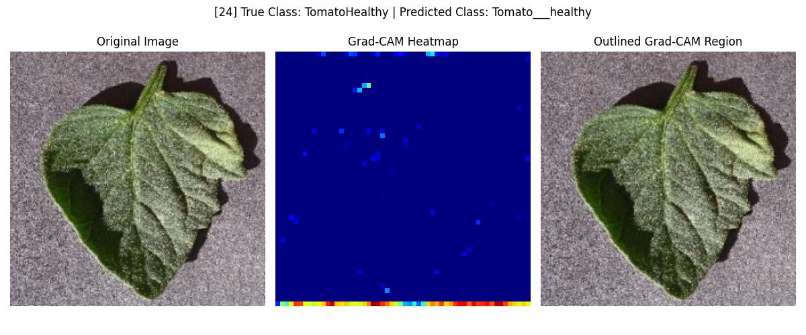
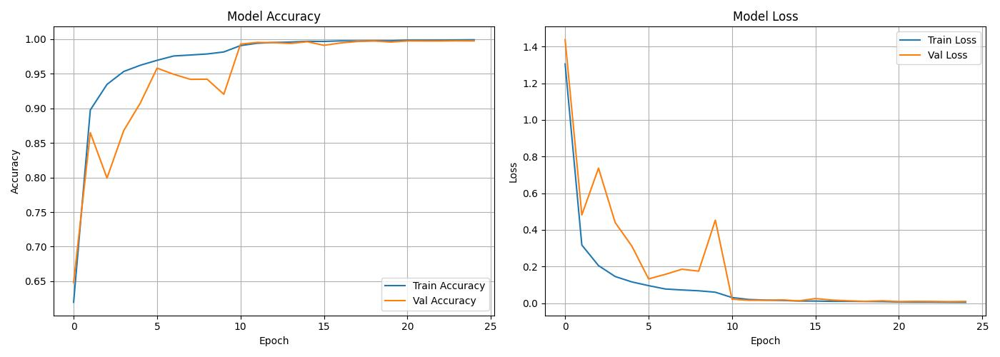

<h1>🌾 Monitoring Crop Health using Deep Learning and Grad-CAM</h1><br>
<h1>📌 Project Objective:</h1>
<br>This project simulates aerial crop health monitoring using deep learning and computer vision. The aim is to classify each region of a crop image as either healthy or unhealthy and highlight the affected areas using Grad-CAM overlays.<br>
<br>
<h1>🧠 Models Used</h1>
<h3>✅ ResNet50 </h3>
ResNet-50 consists of 50 layers that are divided into 5 blocks, each containing a set of residual blocks. The residual blocks allow for the preservation of information from earlier layers, which helps the network to learn better representations of the input data.
<br>
The following are the main components of ResNET.
<br><br>
<b>1. Convolutional Layers</b><br>
The first layer of the network is a convolutional layer that performs convolution on the input image. This is followed by a max-pooling layer that downsamples the output of the convolutional layer. The output of the max-pooling layer is then passed through a series of residual blocks.
<br><br>
<b>2. Residual Blocks</b><br>
Each residual block consists of two convolutional layers, each followed by a batch normalization layer and a rectified linear unit (ReLU) activation function. The output of the second convolutional layer is then added to the input of the residual block, which is then passed through another ReLU activation function. The output of the residual block is then passed on to the next block.
<br><br>
<b>3. Fully Connected Layer</b><br>
The final layer of the network is a fully connected layer that takes the output of the last residual block and maps it to the output classes. The number of neurons in the fully connected layer is equal to the number of output classes.
<br><br>
<h3>✅ EfficientNetB0</h3>
EfficientNetB0 is the baseline model of the EfficientNet family, developed by Google. It balances model accuracy and efficiency using a novel technique called compound scaling, which scales depth, width, and resolution systematically.
<br>
🔧 Key Components:<br>
MBConv Block (Mobile Inverted Bottleneck):<br>
Combines several modern techniques for efficient convolution.
<br>
<b>1. Expansion Layer:</b><br>
Uses a 1x1 convolution to expand input channels, enabling richer feature learning.
<br>
<b>2. Depthwise Convolution (3x3):</b><br>
Applies one filter per input channel to extract spatial patterns efficiently.
<br>
<b>3. Squeeze-and-Excitation:</b><br>
Learns to recalibrate channel-wise responses:
<br>
Squeeze: Global average pooling.
<br>
Excitation: Learns weights to emphasize informative channels.
<br>
<b>4. Projection Layer:</b><br>
Uses a 1x1 convolution to reduce channel dimensions back to target size.<br><br>

<h3>✅ Grad-CAM</h3>
The gradient-weighted class activation map (Grad CAM) produces a heat map that highlights important regions of an image using the target gradients (healthy,unhealthy(type of disease)) of the final convolutional layer.
<br><br>
The Grad CAM method is a popular visualisation technique that is useful for understanding how a convolutional neural network has been driven to make a classification decision. It is class-specific, meaning that it can produce a separate visualisation for each class present in the image.
<br><br>
In the event of a classification error, this method can be very useful for understanding where the problem lies in the convolutional network. It also makes the algorithm more transparent.
<br><br>
<h1>🗃️ Project Structure</h1>

```
Monitoring-Crop-Health-using-Computer-Vision/
├── data/               # Sample input images
├── models/             # Saved model files (.h5)
├── notebooks/          # Training and inference notebooks
│   ├── EfficientNetB0-Training.ipynb
|   ├── ResNet50-Training.ipynb
│   └── inference_notebook.ipynb
├── src/                # Source code scripts
|   ├── Grad-CAM.py
│   ├── Model1(ResNet50_Architecture.py
|   ├── Model2(EfficientNetB0_Architecture.py
│   ├── train.py
│   └── inference.py
├── outputs/            # Grad-CAM outputs and overlayed images
├── requirements.txt    # All dependencies
└── README.md
```
<br>
<h1>📦 Requirements</h1>
Python <br>

TensorFlow <br>

OpenCV<br>

NumPy<br>

Matplotlib<br>

scikit-learn<br>

<h1>Install with:</h1>

```
pip install -r requirements.txt<br>
```

<h1>Uses:</h1>
📂 Dataset Setup
This project uses the New Plant Diseases Dataset (Augmented) (https://www.kaggle.com/datasets/vipoooool/new-plant-diseases-dataset)  from Kaggle.
<br>
Steps to Use:<br>
Download the dataset manually from the link above.
<br>
Extract it in the following directory structure:
```
project-root/
├── data/
│   ├── train/
│   └── valid/
```

The training and validation images should be placed under data/train/ and data/valid/ respectively.

<h1>📁 Dataset</h1>
Used an augmented plant disease dataset with 87k images from Kaggle. [Dataset link](https://www.kaggle.com/datasets/vipoooool/new-plant-diseases-dataset)<br>.<br>
(Dataset is already splited into train,validation and test)<br>

Images categorized as healthy or unhealthy(38 classes).<br>

Dataset was resized(224,224), normalized.<br>

<h1>🛠️ Model Training</h1>
Models were built using the Keras API in TensorFlow.<br>

Both ResNet50 and EfficientNetB0 were trained on the dataset.<br>

Training metrics (accuracy & loss) were tracked using matplotlib.<br>

<h1>📄 Output:</h1>
Trained model saved as .h5 format under /models/.<br>

<h1>🎯 Inference & Visualization</h1>
The trained model was used to predict crop health from test images.<br>

Grad-CAM was used to highlight diseased regions:<br>

Red overlays show unhealthy vegetation.<br>

Output images show both original and heatmap overlays.<br>

<h1>📸 Sample Output</h1>

 <br>
 <br>
 <br>

<h1>📈 Results</h1>
<table border="1" cellpadding="5">
<thead>
<tr>
<th>Model</th>
<th>Accuracy</th>
<th>Parameters</th>
<th>Grad-CAM Compatible</th>
</tr>
</thead>
<tbody>
<tr>
<td>ResNet50</td>
<td>100.0%</td>
<td>~24 Million 🔺</td>
<td>✅ Yes (Lightweight)</td>
</tr>
<tr>
<td>EfficientNetB0</td>
<td>99.7%</td>
<td>~7 Million 🔻</td>
<td>✅ Yes (Lightweight & Attention-Enhanced)</td>
</tr>
</tbody>
</table>
<b>Accuracy and loss plots:</b><br>

 <br>

<h1>🤝 Acknowledgements</h1>
Dataset: Kaggle – New Plant Diseases Dataset (Augmented)<br>

TensorFlow, OpenCV, and Keras Teams<br>

<h1>📬 Contact</h1>
For questions or collaborations, contact prashu150603@gmail.com.
