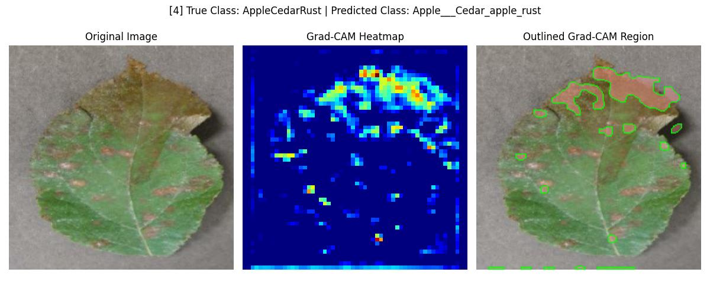
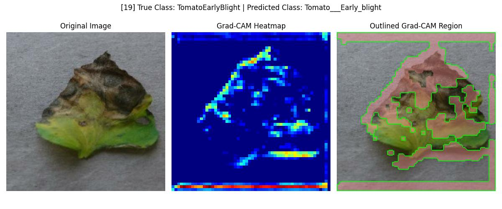

<h1>🌾 Monitoring Crop Health using Deep Learning and Grad-CAM</h1><br>
<b>📌 Project Objective</b>:<br>
<br>This project simulates aerial crop health monitoring using deep learning and computer vision. The aim is to classify each region of a crop image as either healthy or unhealthy and highlight the affected areas using Grad-CAM overlays.<br>

<b>🧠 Models Used</b><br>
<b>✅ ResNet50 </b>– Deep residual CNN for classification<br>

<b>✅ EfficientNetB0</b> – Lightweight model optimized for performance<br>

<b>✅ Grad-CAM</b> – Used to visualize important regions contributing to the model's decision<br>

<b>🗃️ Project Structure</b><br>
```
Monitoring-Crop-Health-using-Computer-Vision/
├── data/               # Sample input images
├── models/             # Saved model files (.h5 or .keras)
├── notebooks/          # Training and inference notebooks
│   ├── training.ipynb
│   └── inference_gradcam.ipynb
├── src/                # Source code scripts
│   ├── model_builder.py
│   ├── train.py
│   ├── gradcam_utils.py
│   └── inference.py
├── outputs/            # Grad-CAM outputs and overlayed images
├── requirements.txt    # All dependencies
└── README.md
```
<b>📦 Requirements</b><br>
Python ≥ 3.8<br>

TensorFlow ≥ 2.8<br>

OpenCV<br>

NumPy<br>

Matplotlib<br>

scikit-learn<br>

Install with:<br>
pip install -r requirements.txt<br>
<b>📁 Dataset</b><br>
Used an augmented plant disease dataset from Kaggle.<br>

Images categorized as healthy or unhealthy.<br>

Dataset was resized, normalized, and split into train/test sets.<br>

<b>🛠️ Model Training</b><br>
Models were built using the Keras API in TensorFlow.<br>

Both ResNet50 and EfficientNetB0 were trained on the dataset.<br>

Training metrics (accuracy & loss) were tracked using matplotlib.<br>

<b>📄 Output:</b><br>

Trained model saved as .h5 format under /models/.<br>

<b>🎯 Inference & Visualization</b><br>
The trained model was used to predict crop health from test images.<br>

Grad-CAM was used to highlight diseased regions:<br>

Red overlays show unhealthy vegetation.<br>

Output images show both original and heatmap overlays.<br>

<b>📂 Output:</b><br>

Saved visualizations in /outputs/ as .jpg images.<br>

Optionally, calculated the % area affected by disease per image.<br>

<b>📸 Sample Output</b><br>
 <br>
 <br>
 <br>

<b>📈 Results</b><br>
|Model|	Accuracy|	Params|	Suitable For Grad-CAM<br>|
|ResNet50|	✅ High|	🔺 ~25M|	✅ Yes|
|EfficientNetB0|	✅ Good|	🔻 ~5M|	✅ Yes (lightweight)|

<b>🤝 Acknowledgements</b><br>
Dataset: Kaggle – New Plant Diseases Dataset (Augmented)<br>

TensorFlow, OpenCV, and Keras Teams<br>

<b>📬 Contact</b><br>
For questions or collaborations, contact [your email or GitHub profile].
